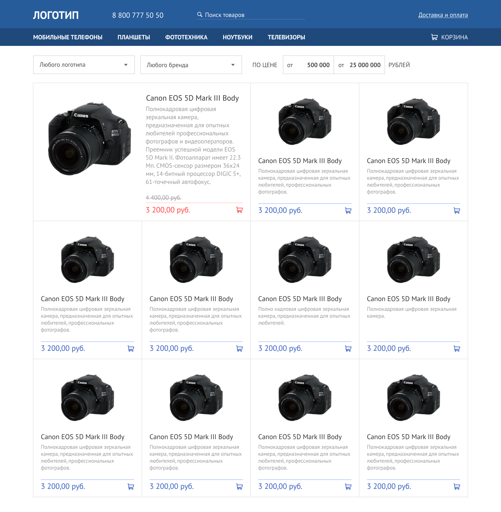

Верстка адаптивной и  кроссбраузерный страницы сделана с помощью таcк-менеджера GULP  
Ссылка на макет в фигме: https://www.figma.com/file/dB5OW56sLZVK3ZLp2lQqEf  
Реализована верстка фильтра с ховерами, выпадающим меню (без переходов и фильтрации, только верстка)  
Использованы библиотеки jQuery и jQuery Selectric  
Использовано современное разрешение изображений AVIF и векторная графика SVG   
Файлы сайта проверены валидаторами от W3C(HTML&CSS) и на скорость загрузки PageSpeed Insights   
Старничка протестирована в различных браузерах на системах Windows 10 и Android 13  

